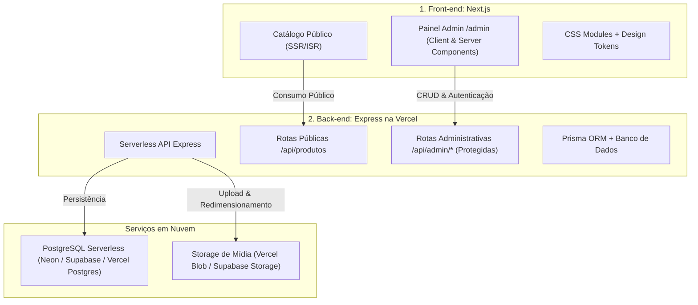

# Diretrizes de Desenvolvimento e Arquitetura Técnica - TS EYEWEAR

Este documento estabelece as diretrizes de engenharia de software, organização dos **2 repositórios**, stack tecnológica, fluxo de build/deploy na **Vercel** e especificações do **Painel Administrativo** da **TS EYEWEAR** (operação **100% online**).

---

## 1. Visão Geral da Arquitetura (2 Repositórios)

O projeto é dividido em duas aplicações desacopladas, ambas projetadas para alta performance e escalabilidade serverless na **Vercel**:



1. **Repositório 1: Front-end (`frontend/`)**:
   * **Tecnologia**: **Next.js 14+** com **TypeScript** e **App Router**.
   * **Áreas**:
     * **Pública**: Catálogo, vitrine, filtros, busca, favoritos e fechamento via WhatsApp.
     * **Administrativa (`/admin`)**: Dashboard, formulários de produtos com upload drag-and-drop, gestão de variações, estoque em tempo real e categorias.
   * **Estilização**: **Vanilla CSS via CSS Modules** (`*.module.css`) combinados com os Design Tokens globais (`tokens.css`).
   * **Deploy**: Projeto Vercel dedicado (Front-end).

2. **Repositório 2: Back-end / Integração (`backend/`)**:
   * **Tecnologia**: **Node.js + Express**, estruturado com `@vercel/node` e `vercel.json`.
   * **Papel**: Servir endpoints REST para catálogo, paginação, filtros avançados, consulta de modelos e cálculo de regras de entrega (Frete Grátis para todo o Brasil).
   * **Persistência**: **Prisma ORM** conectado a banco **PostgreSQL no Supabase**.
   * **Deploy**: Projeto Vercel dedicado com rotas serverless sob o domínio da API.

---

## 2. Estrutura de Diretórios dos Repositórios

```
Catálogo Online/
├── docs/                           # Documentações e regras de negócio da TS EYEWEAR
├── agents/                         # Instruções dos agentes especializados
├── script-py-image-scam/           # Pipeline em Python de tratamento de fotos e metadados
│
├── frontend/                       # [REPOSITÓRIO 1: Next.js App]
│   ├── src/
│   │   ├── app/                    # App Router
│   │   │   ├── layout.tsx          # Layout global público
│   │   │   ├── page.tsx            # Home Page pública
│   │   │   ├── catalogo/           # Catálogo público
│   │   │   ├── produto/[id]/       # PDP - Detalhes do Produto
│   │   │   ├── favoritos/          # Lista de favoritos
│   │   │   │
│   │   │   └── admin/              # [PAINEL ADMINISTRATIVO]
│   │   │       ├── layout.tsx      # Layout com sidebar admin e navegação
│   │   │       ├── login/          # Tela de autenticação
│   │   │       ├── dashboard/      # Métricas e status do catálogo
│   │   │       ├── produtos/       # Tabela de produtos e ações de status
│   │   │       │   ├── page.tsx
│   │   │       │   ├── novo/page.tsx   # Formulário de cadastro completo
│   │   │       │   └── [id]/page.tsx   # Formulário de edição
│   │   │       └── categorias/     # Gestão de categorias e subcategorias
│   │   ├── components/             # Componentes públicos e administrativos
│   │   │   ├── admin/              # Componentes exclusivos do painel
│   │   │   │   ├── AdminSidebar/
│   │   │   │   ├── DropzoneUpload/ # Upload e ordenação drag-and-drop
│   │   │   │   ├── VariacoesTable/ # Gestão de tamanhos/cores
│   │   │   │   └── EstoqueControl/ # Baixa e ajuste manual de estoque
│   │   │   └── public/             # Componentes do catálogo (Header, CardProduto, etc.)
│   │   ├── middleware.ts           # Proteção de rotas /admin via JWT HttpOnly
│   │   ├── styles/                 # tokens.css, globals.css, *.module.css
│   │   └── services/               # Clientes de API pública e administrativa
│   ├── package.json
│   └── next.config.mjs
│
└── backend/                        # [REPOSITÓRIO 2: Express na Vercel]
    ├── src/
    │   ├── app.js                  # Inicialização, middlewares e montagem de rotas
    │   ├── routes/
    │   │   ├── public/             # Rotas abertas para o catálogo
    │   │   │   ├── produtos.routes.js
    │   │   │   ├── banners.routes.js
    │   │   │   └── frete.routes.js
    │   │   └── admin/              # Rotas protegidas para o Painel Admin
    │   │       ├── auth.routes.js
    │   │       ├── produtos.admin.routes.js
    │   │       ├── categorias.admin.routes.js
    │   │       ├── estoque.admin.routes.js
    │   │       └── midia.admin.routes.js
    │   ├── middlewares/
    │   │   ├── auth.middleware.js  # Verificação de token JWT
    │   │   ├── upload.middleware.js# Multer com processamento de imagem (Sharp)
    │   │   └── validate.middleware.js
    │   ├── services/               # Lógica de negócio, upload para nuvem e storage
    │   │   └── storage.service.js  # Integração com Vercel Blob / Supabase Storage
    │   └── prisma/                 # Modelagem de dados e migrações
    │       └── schema.prisma
    ├── api/
    │   └── index.js                # Handler Serverless da Vercel
    ├── vercel.json                 # Configuração de build e rotas Vercel
    └── package.json
```

---

## 3. Modelagem de Dados com Prisma (`backend/src/prisma/schema.prisma`)

```prisma
datasource db {
  provider = "postgresql"
  url      = env("DATABASE_URL")
}

generator client {
  provider = "prisma-client-js"
}

enum StatusProduto {
  ATIVO
  OCULTO
  ARQUIVADO
}

enum TipoMidia {
  IMAGEM
  VIDEO
}

model UsuarioAdmin {
  id        String   @id @default(uuid())
  nome      String
  email     String   @unique
  senhaHash String
  criadoEm  DateTime @default(now())
}

model Categoria {
  id            String         @id @default(uuid())
  nome          String         @unique
  slug          String         @unique
  ordem         Int            @default(0)
  ativo         Boolean        @default(true)
  subcategorias Subcategoria[]
  produtos      Produto[]
}

model Subcategoria {
  id          String    @id @default(uuid())
  nome        String
  slug        String
  categoriaId String
  categoria   Categoria @relation(fields: [categoriaId], references: [id], onDelete: Cascade)
  produtos    Produto[]
}

model Produto {
  id               String            @id @default(uuid())
  skuPai           String            @unique
  titulo           String
  slug             String            @unique
  descricao        String            @db.Text
  precoVenda       Decimal           @db.Decimal(10, 2)
  precoPromocional Decimal?          @db.Decimal(10, 2)
  destaqueHome     Boolean           @default(false)
  novidade         Boolean           @default(false)
  outlet           Boolean           @default(false)
  status           StatusProduto     @default(ATIVO)
  categoriaId      String
  categoria        Categoria         @relation(fields: [categoriaId], references: [id])
  subcategoriaId   String?
  subcategoria     Subcategoria?     @relation(fields: [subcategoriaId], references: [id])
  variacoes        ProdutoVariacao[]
  midias           ProdutoMidia[]
  criadoEm         DateTime          @default(now())
  atualizadoEm     DateTime          @updatedAt
}

model ProdutoVariacao {
  id                 String       @id @default(uuid())
  produtoId          String
  produto            Produto      @relation(fields: [produtoId], references: [id], onDelete: Cascade)
  skuVariacao        String       @unique
  corNome            String
  corHex             String?
  aroMm              Int
  ponteMm            Int
  hasteMm            Int
  material           String
  estoqueAtual       Int          @default(0)
  precoDiferenciado  Decimal?     @db.Decimal(10, 2)
  statusAtivo        Boolean      @default(true)
  midias             ProdutoMidia[]
}

model ProdutoMidia {
  id         String           @id @default(uuid())
  produtoId  String
  produto    Produto          @relation(fields: [produtoId], references: [id], onDelete: Cascade)
  variacaoId String?
  variacao   ProdutoVariacao? @relation(fields: [variacaoId], references: [id], onDelete: SetNull)
  url        String
  tipo       TipoMidia        @default(IMAGEM)
  ordem      Int              @default(0)
  principal  Boolean          @default(false)
}
```

---

## 4. Endpoints da API Administrativa (`backend/src/routes/admin/`)

Todas as rotas sob `/api/admin/*` exigem token JWT válido (via Bearer Token ou Cookie HttpOnly).

| Método | Rota | Descrição |
| :--- | :--- | :--- |
| `POST` | `/api/admin/auth/login` | Autentica administrador e retorna sessão/cookie seguro |
| `GET` | `/api/admin/produtos` | Lista completa de produtos com contadores de estoque e status |
| `POST` | `/api/admin/produtos` | Cria produto completo (dados gerais, variações, mídias e categorias) |
| `GET` | `/api/admin/produtos/:id` | Retorna produto com todas as variações e mídias para edição |
| `PUT` | `/api/admin/produtos/:id` | Atualiza produto pai e sincroniza variações |
| `PATCH`| `/api/admin/produtos/:id/visibilidade` | Alterna status (`ATIVO` / `OCULTO` / `ARQUIVADO`) |
| `PATCH`| `/api/admin/produtos/:id/estoque` | Ajuste rápido de estoque manual por variação |
| `POST` | `/api/admin/midia/upload` | Recebe arquivo, processa com Sharp (`600x600 WebP`) e faz upload no storage |
| `PUT` | `/api/admin/midia/ordenar` | Atualiza a ordem visual das mídias após arrasto drag-and-drop |
| `GET/POST/PUT` | `/api/admin/categorias` | Gestão de categorias e subcategorias |

---

## 5. Processamento e Upload de Mídia

O serviço `storage.service.js` padroniza os uploads:
1. **Imagens**:
   * O buffer recebido via Multer passa pela biblioteca **Sharp**:
     * Redimensionamento para `600x600px` com `fit: 'contain'` e margem de 15%.
     * Conversão para formato **WebP** com qualidade 85%.
   * Envio para o Storage (Vercel Blob ou Supabase Storage).
   * Retorno da URL pública segura HTTPS.
2. **Vídeos**:
   * Validação de tamanho (máximo 15MB) e formato (`.mp4`, `.webm`).
   * Envio direto para o storage com streaming eficiente.
